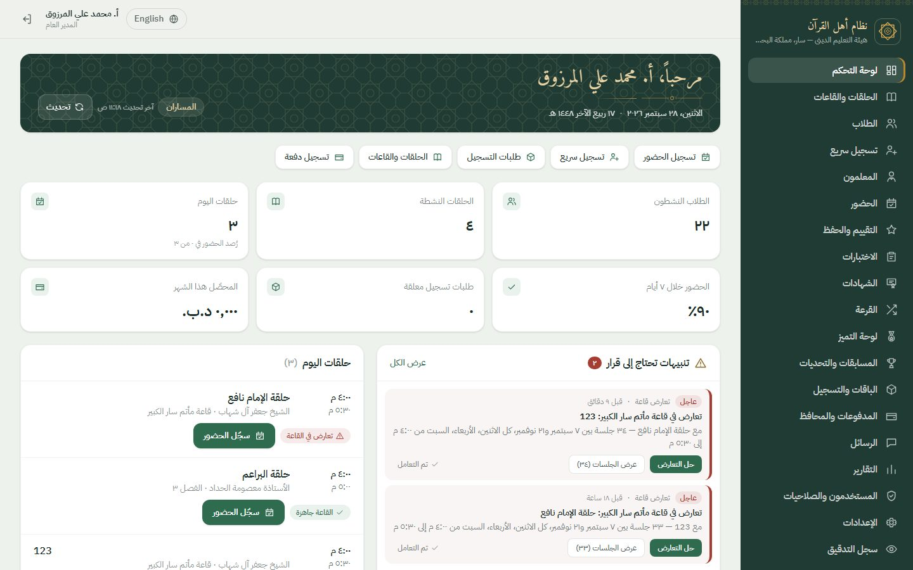
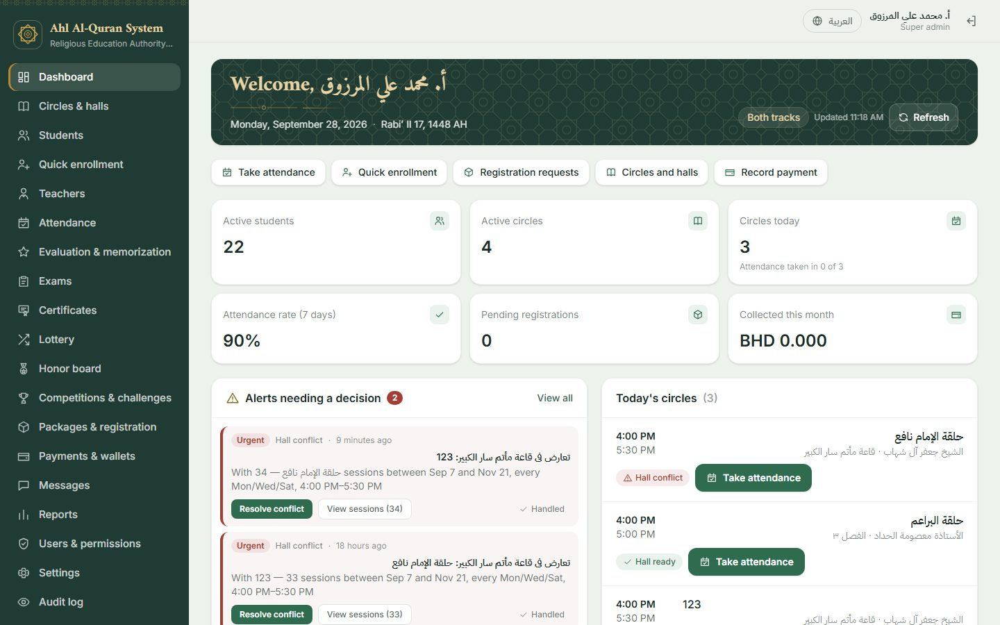
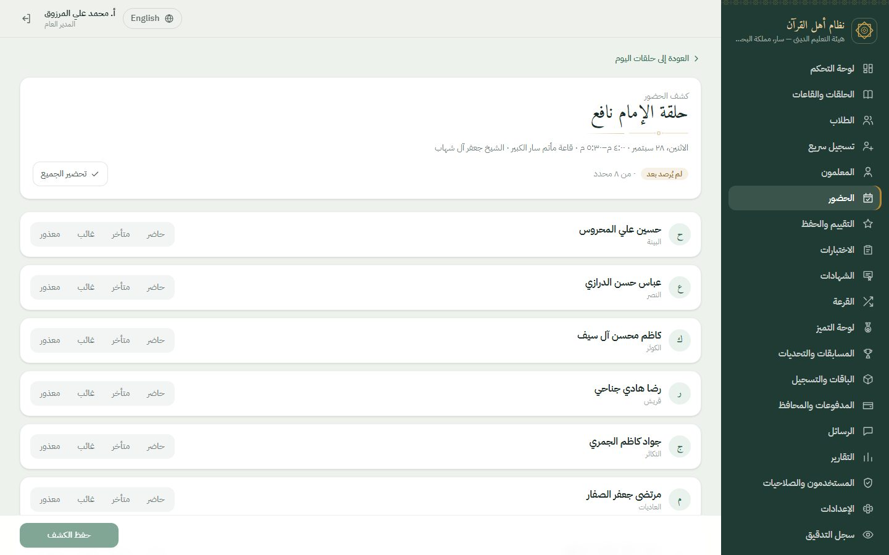
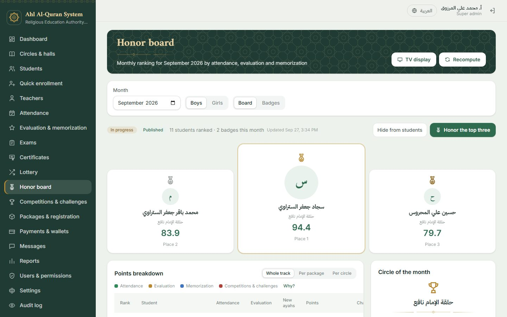

# نظام أهل القرآن — Ahl Al-Quran System

نظام إدارة حلقات تحفيظ القرآن الكريم لهيئة التعليم الديني — سار، البحرين.
Quran circles (halaqat) management system for the Religious Education Authority — Sar, Bahrain.

| Part | Path | Stack |
|------|------|-------|
| API | `backend/` | Laravel 12 (PHP 8.2+), Sanctum, spatie/permission, dompdf, maatwebsite/excel, Intervention Image, Scribe, Pest |
| Web app | `frontend/` | React 18, Vite, TypeScript, TanStack Query, RHF + Zod, Tailwind (RTL/LTR), Recharts, i18next |
| WhatsApp bridge | `whatsapp/` | Node + open-wa/wa-automate |
| Packages | `packages/` | Reusable in other systems: certificates (Laravel + React), `@ahl/id-card-reader` (Bahrain ID card reading + reception PC setup kit) |
| Docs | `docs/` | ERD, migrations, work plan, deployment, ID card reader setup |

### Screenshots — لقطات

| لوحة التحكم | Dashboard |
|---|---|
|  |  |
| **كشف الحضور** | **Honor board** |
|  |  |

More screens (students, circles, evaluation, enrollment, messages, reports, phone): [docs/screenshots](docs/screenshots/README.md).
مزيد من الشاشات في [docs/screenshots](docs/screenshots/README.md).

---

## العربية

### التشغيل بدون Docker (SQLite — للتطوير)

```bash
cd backend
cp .env.example .env            # DB_CONNECTION=sqlite جاهز افتراضياً
composer install
php artisan key:generate
touch database/database.sqlite  # على ويندوز: type nul > database\database.sqlite
php artisan migrate --seed
php artisan serve               # http://localhost:8000  — التوثيق على /docs
php artisan queue:work          # في نافذة أخرى
php artisan schedule:work       # في نافذة أخرى (بديل cron محلياً)

cd ../frontend
cp .env.example .env            # VITE_API_PROXY_TARGET = عنوان الخادم
npm install && npm run dev      # http://localhost:5173  ← صفحة الدخول
```

إذا كان المنفذ 8000 أو 5173 مستخدماً: `php artisan serve --port=8010` وعدّل `VITE_API_PROXY_TARGET`، و `npm run dev -- --port 5180`.

### التبديل إلى MySQL أو PostgreSQL

غيّر فقط قيم `DB_*` في `backend/.env` (الأمثلة موجودة في `.env.example`) ثم:

```bash
php artisan migrate --seed
```

لا يوجد أي تغيير في الكود. كل الجداول تُنشأ عبر Schema Builder فقط، ولا توجد أنواع أعمدة خاصة بمحرك معيّن.

### نقل البيانات من SQLite إلى MySQL / PostgreSQL

```bash
# 1) في .env اضبط TRANSFER_DB_* على قاعدة البيانات الجديدة (mysql أو pgsql)
# 2) أنشئ الجداول في الهدف
php artisan migrate --database=transfer_target --force
# 3) انسخ كل الجداول على دفعات
php artisan db:transfer --from=sqlite --to=transfer_target --truncate
# 4) بدّل DB_CONNECTION في .env إلى المحرك الجديد
```

### النسخ الاحتياطي والاستعادة

```bash
php artisan db:backup                        # mysqldump / pg_dump / نسخ ملف SQLite حسب المحرك
php artisan db:restore storage/app/backups/<file> --force
```

### الجدولة (cron واحد)

```
* * * * * cd /path/to/backend && php artisan schedule:run >> /dev/null 2>&1
```

### الاختبارات

```bash
cd backend && php artisan test          # SQLite في الذاكرة
```
على MySQL و PostgreSQL تُشغَّل الاختبارات تلقائياً في GitHub Actions (`.github/workflows/ci.yml`) عبر حاويات خدمية. محلياً يمكن تشغيلها بضبط `DB_*` ثم `php artisan test`.

---

## English

### Run without Docker (SQLite — development)

```bash
cd backend
cp .env.example .env            # DB_CONNECTION=sqlite is the default
composer install
php artisan key:generate
touch database/database.sqlite  # Windows: type nul > database\database.sqlite
php artisan migrate --seed
php artisan serve               # http://localhost:8000 — API docs at /docs
php artisan queue:work          # second terminal
php artisan schedule:work       # third terminal (local stand-in for cron)

cd ../frontend
cp .env.example .env            # VITE_API_PROXY_TARGET = backend URL
npm install && npm run dev      # http://localhost:5173  (login page)
```

If port 8000 or 5173 is already taken: run `php artisan serve --port=8010`, set `VITE_API_PROXY_TARGET` to match, and run `npm run dev -- --port 5180`.

### Switch to MySQL 8 or PostgreSQL 15

Change only the `DB_*` values in `backend/.env` (commented examples are in `.env.example`), then:

```bash
php artisan migrate --seed
```

No code changes. All schema goes through the Schema builder, no driver-specific column types or SQL functions are used, and reports aggregate with COUNT/SUM/AVG/MIN/MAX and group dates in PHP.

### One-command Docker setup

```bash
docker compose --profile mysql up -d     # app + nginx + queue + scheduler + whatsapp + MySQL 8
docker compose --profile pgsql up -d     # same, with PostgreSQL 15
docker compose up -d                     # app only, SQLite inside the container
```
Production setup, HTTPS, WhatsApp, updates and backups: [docs/04-DEPLOYMENT.md](docs/04-DEPLOYMENT.md). Copy `.env.production.example` to `.env` first.
Add `--profile whatsapp` to run the open-wa bridge (`whatsapp/`).

### Migrate data from SQLite to MySQL / PostgreSQL

```bash
# 1) In .env, point TRANSFER_DB_* at the new database (mysql or pgsql)
# 2) Create the schema on the target
php artisan migrate --database=transfer_target --force
# 3) Copy every table in chunks through the Query Builder
php artisan db:transfer --from=sqlite --to=transfer_target --truncate
# 4) Switch DB_CONNECTION in .env to the new driver
```

### Backup and restore

```bash
php artisan db:backup            # mysqldump / pg_dump / SQLite file copy, chosen by driver
php artisan db:restore storage/app/backups/<file> --force
```

Binary paths can be overridden with `MYSQLDUMP_PATH`, `MYSQL_PATH`, `PG_DUMP_PATH`, `PSQL_PATH`.

### Scheduler (single cron)

```
* * * * * cd /path/to/backend && php artisan schedule:run >> /dev/null 2>&1
```

### Tests

```bash
cd backend && php artisan test   # SQLite in memory
```

MySQL and PostgreSQL runs happen in GitHub Actions (`.github/workflows/ci.yml`) with service containers. To run locally against either, set `DB_*` in `.env` (or export them) and run `php artisan test`.

### Demo accounts (DemoSeeder only — never in production)

Load them with `php artisan db:seed --class=DemoSeeder` on a developer machine. It runs only with `APP_ENV=local` (or `testing`) **and** `WHATSAPP_PROVIDER=log`, and refuses anywhere else: the passwords below are public, and the phone numbers may belong to real people. Never load demo data on a server that others can reach.
`php artisan migrate --seed` loads reference data only (roles, permissions, settings, templates, surahs, badges).

| Role | Name | Phone | Track | Sign-in |
|------|------|-------|-------|---------|
| Super Admin | أ. محمد علي المرزوق | +973 3600 0001 | both (always) | password `password` |
| Supervisor (boys) | أ. حسن جعفر الجمري | +973 3600 0002 | male | password `password` |
| Supervisor (girls) | أ. فاطمة الشيخ | +973 3600 0006 | female | password `password` |
| Teacher (boys) | الشيخ جعفر آل شهاب | +973 3600 0003 | male | password `password` |
| Teacher (girls) | الأستاذة زينب الموسوي | +973 3600 0007 | female | password `password` |
| Teacher (boys, no circle yet) | الأستاذ عباس المرزوق | +973 3600 0008 | male | password `password` |
| Teacher (early years, mixed) | الأستاذة معصومة الحداد | +973 3600 0009 | female | password `password` |
| Student (boy) | حسين علي المحروس | +973 3600 0004 | male | WhatsApp code (shown on screen when `WHATSAPP_PROVIDER=log`) |
| Guardian (a boy, a girl, an early-years boy) | علي حسن المحروس | +973 3600 0005 | — | WhatsApp code |
| Guardians (sibling families) | جعفر محمد الستراوي · حسن كاظم آل عباس · مهدي رضا السماهيجي | +973 3600 0010 · 0011 · 0012 | — | WhatsApp code |
| Demo class guardians | e.g. حسن محمد الدرازي | +973 3611 0001–0006 (boys), +973 3612 0001–0006 (girls) | — | WhatsApp code |
| Registration request guardians | e.g. حسن محمد الخباز | +973 3613 0001–0010 | — | WhatsApp code |

Names are Bahraini Shia names in Arabic (the shared list is `database/factories/Support/BahrainiNames.php`).
The demo also creates four halls (قاعة مأتم سار الكبير for boys, قاعة النساء بالهيئة for girls, and قاعة الهيئة ٢ and الفصل ٣ shared by schedule),
a boys package, a girls package and one mixed early-years package for ages 4–6, each with a circle,
four sibling families under one guardian login each (المحروس, الستراوي, آل عباس, السماهيجي),
six extra students in the boys and girls circles, and three weeks of sessions with attendance, daily scores and memorization history.

Engagement demo (sections 13–14, `EngagementDemoSeeder`, called by `DemoSeeder`): this month's honor boards for both tracks (computed and published),
a boys' Juz Amma competition in judging (two judges, first round scored), a girls' tajweed competition open for registration,
and one challenge per track with every eligible student joined.

Operations demo (`OperationsDemoSeeder`, called by `DemoSeeder` before the engagement demo) fills the remaining staff pages:
term invoices with payments by every method (some partial, some overdue, one duplicate payment refunded),
eleven public registration requests (pending, waitlisted, rejected, enrolled, and four boys waiting for the lottery),
a second boys circle (حلقة الإمام عاصم, +973 3600 0008) and a lottery that has been run and waits for approval,
a graded online exam (boys) with exam certificates, some approved and some awaiting approval, a graded paper exam (girls), an online exam opening next week and a draft final exam,
student follow-up cases with notes, the WhatsApp inbox (confirmations, excuses applied, pending and approved, an open question, an opt-out),
hall bookings and a one-day hall change, and the repeated-absence and overdue-invoice alerts.

### Honor board TV display

The centre screen opens `/display/honor?key=<key>&gender=male|female&lang=ar|en` without a login. It refreshes every minute
and shows only a published board, with first and second names and no photos.
The key is the `honor.display_key` setting (Settings → Honor board); an empty key turns the screen off.
The demo key is `demo-tv-2026`, for example `http://127.0.0.1:5180/display/honor?key=demo-tv-2026&gender=male`.

### Scheduled jobs added in Group C/D

| Command | When | What |
|---|---|---|
| `engagement:run daily` | 01:30 daily | Recompute this month's honor boards (per track), close last month on day 1, refresh challenges, send challenge nudges |
| `engagement:run reminders` | hourly | Competition registration opened / closing within 24 h, round the next day (each once) |
| `lessons:send-reminders` | existing | Now plans the two section 23 reminders (long 2 h, short 1 h) and releases due scheduled messages |

### WhatsApp inbound replies (section 23)

Replies from families arrive at `POST /api/public/whatsapp/inbound` with the header `X-Webhook-Secret`.

| Variable | Meaning |
|---|---|
| `WHATSAPP_INBOUND_SECRET` | Shared secret for the inbound webhook (empty disables it). The open-wa bridge sends it as `INBOUND_WEBHOOK_SECRET`; for the Cloud API it is also the verify token. |
| `WHATSAPP_CLOUD_APP_SECRET` | Cloud API app secret used to check the `X-Hub-Signature-256` of inbound calls. |

Keywords: «حاضر / yes» confirms attendance (the short reminder is then skipped), «عذر / excuse» records an excuse,
«إيقاف / stop» and «تشغيل / start» turn messages off and on. Anything else goes to Messages → Inbox & excuses.
