# Ahl Al-Quran System — Entity Relationship Diagram
# نظام أهل القرآن — مخطط قاعدة البيانات

## Conventions

- Every table: `id` = unsigned big integer; `created_at` / `updated_at` stored in UTC, shown in Asia/Bahrain by API Resources.
- Status / type columns are `string(32)` columns validated in Form Requests and backed by PHP enums. No DB `ENUM`.
- Money columns end in `_fils` and are integers (1 BHD = 1000 fils).
- Files are never stored in the DB. Every file (photo, receipt image, receipt PDF, exam sheet, recitation audio, certificate PDF, logo) is a row in **`media`** (polymorphic, single source of truth) and lives on the configured Filesystem disk (local or S3). The only cached paths are `students.photo_path` / `photo_thumb_path` (denormalised for per-row rendering in lists and rosters). Path columns shown on `certificates`, `exam_attempts`, `exam_answers` and `payments` in the diagrams below were **removed** in the approved revision; those files are `media` rows with collections `certificate`, `exam_sheet`, `recitation`, `receipt_image`, `receipt_pdf`.
- Money out is recorded in **`refunds`** (linked to the `refund`-type wallet transaction); `payments.amount_fils` is always positive.
- `packages` carry `name_ar` / `name_en` beside `name`; `registration_requests` carry `waitlist_position`.
- `students.guardian_phone` is a synced copy of the guardian user's phone; it is changed only on the guardian user and propagated to all children.
- List-like columns (`days`, `options`, `correct_answer`, `question_order`, `variables`, `old_values`) are `text` holding a JSON string, cast with Eloquent `array`. No JSON operators are used in queries, so the same code runs on MySQL, PostgreSQL and SQLite.
- The domain "session" (a class held on a date) is named **`lesson_sessions`**, because Laravel already owns a `sessions` table for the session driver.
- Bilingual: `locale` (`ar` | `en`) on `users`, `students` and `registration_requests`; every message template has `body_ar` and `body_en`. User-entered content (package names, notes) is stored once as entered.

## A. Identity, access and platform

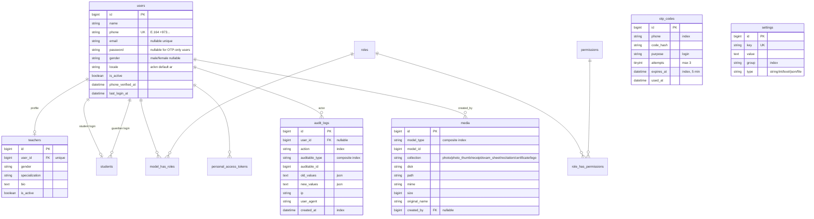

## B. Packages and registration

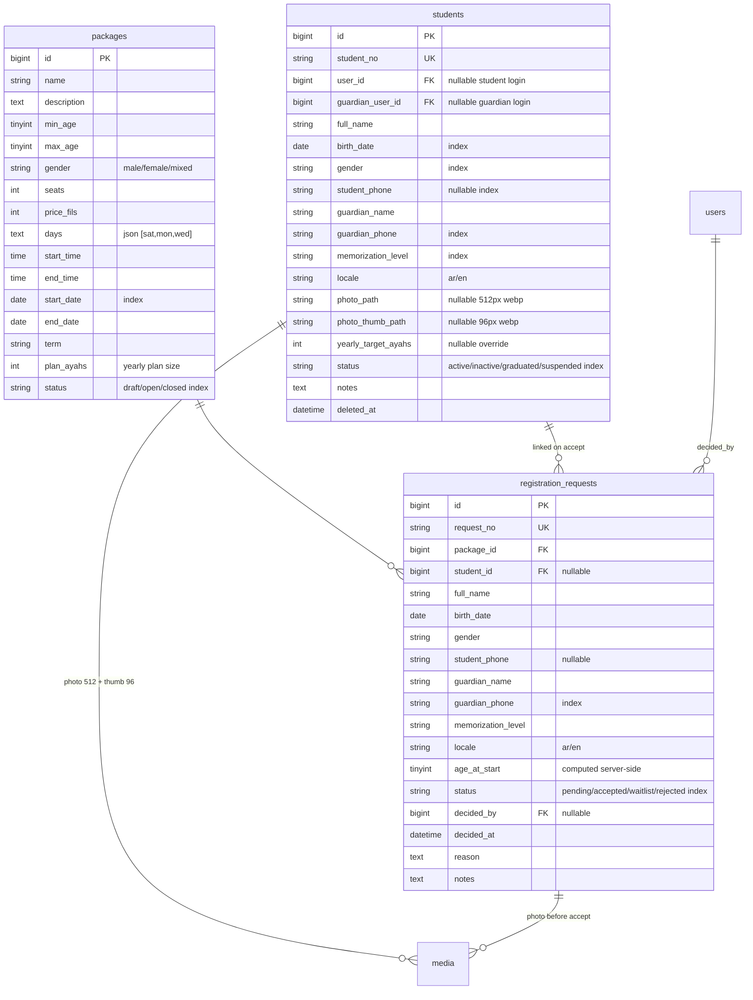

## C. Lessons, locations, sessions and attendance

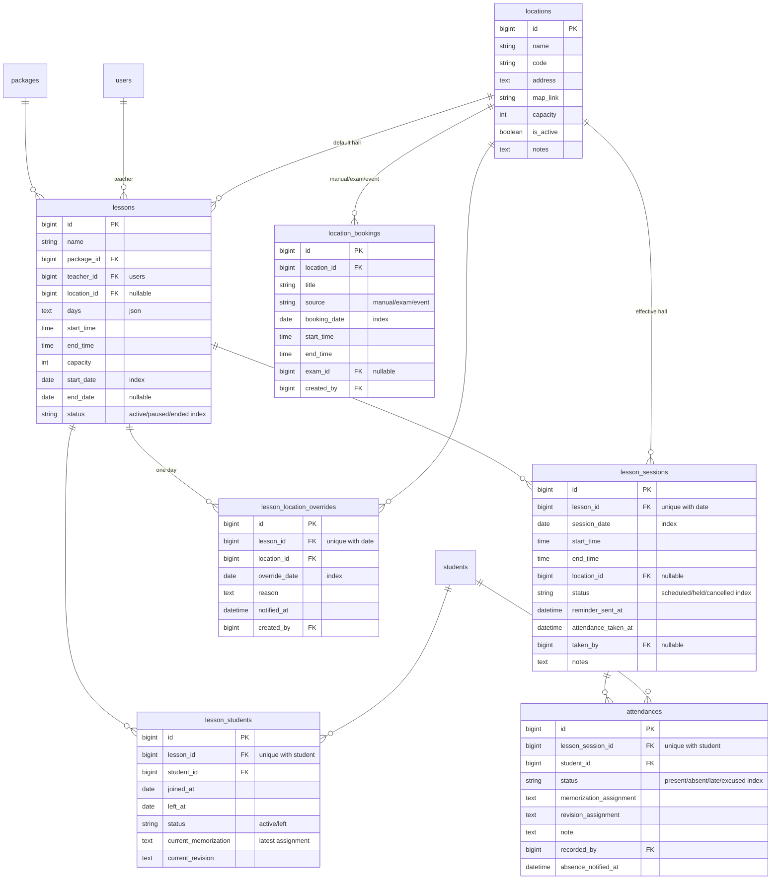

## D. Evaluation, progress and certificates

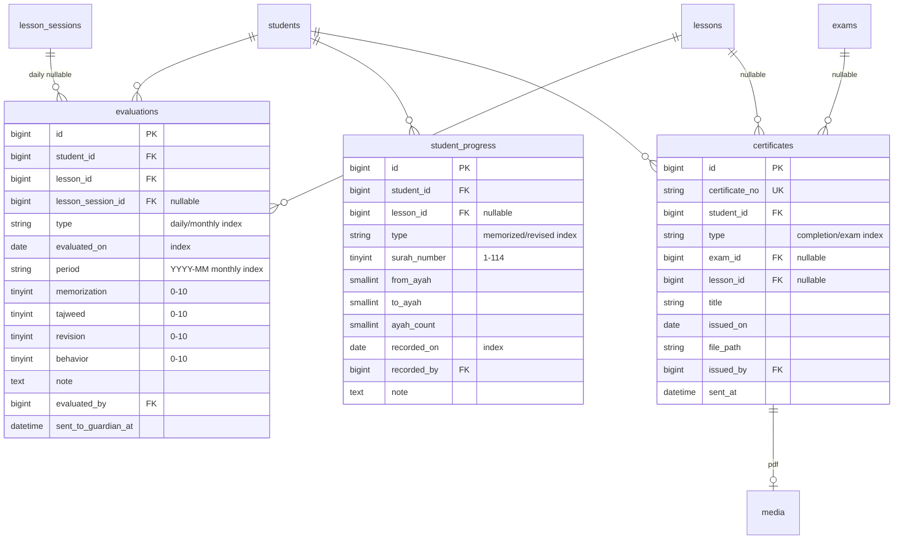

### D2. Quran position and difficulties (added 2026-09-27, section 12)

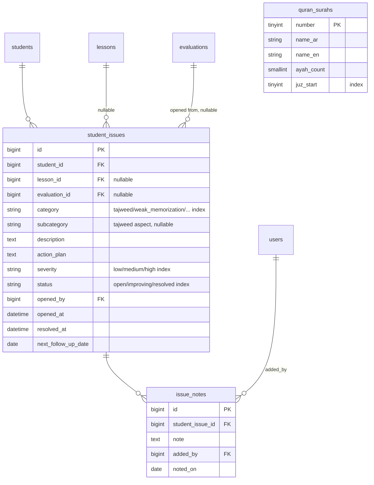

- `packages.memorization_direction` string(32) `forward` / `backward` (default backward).
- `students.progress_surah`, `progress_ayah`, `progress_juz` (index), `memorized_ayahs`: a cache recomputed from `student_progress` on every ledger change. The ledger stays the source of truth and the position is never typed manually.
- Juz is derived in code (`App\Support\Quran`) from the 30 juz start points; `quran_surahs` is reference data inserted by its migration.

## E. Lottery

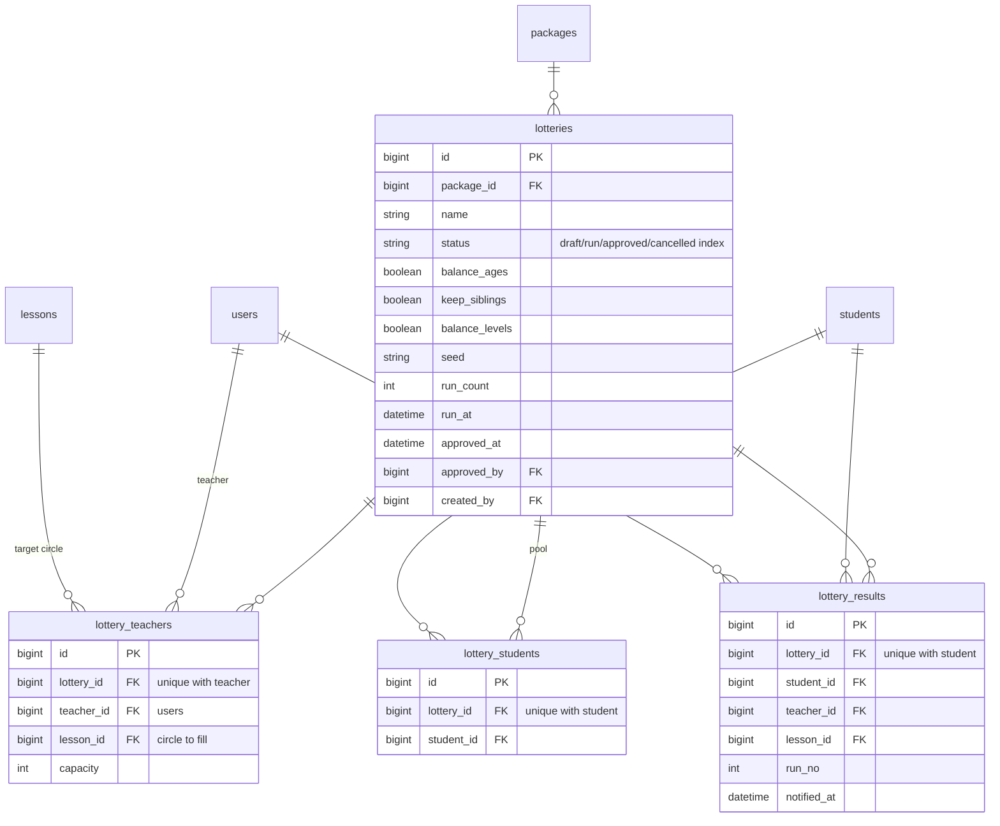

## F. Exams

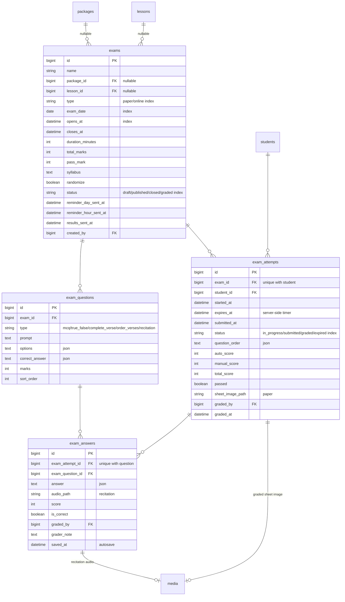

## G. Wallet, invoices and payments

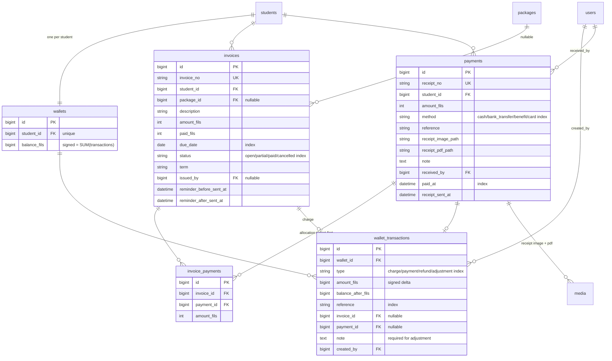

## H. Messaging, alerts and background work

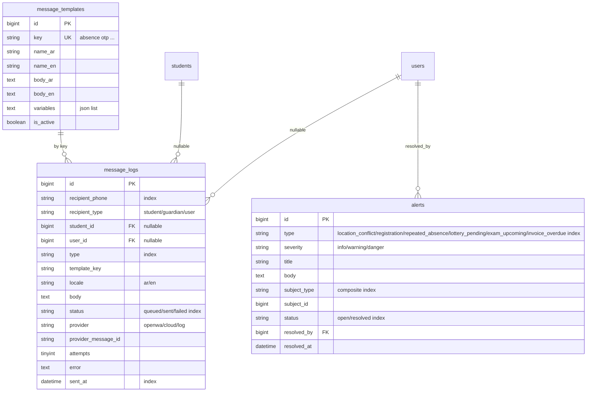

Laravel-owned tables (framework migrations, unchanged): `password_reset_tokens`, `sessions`, `cache`, `cache_locks`, `jobs`, `job_batches`, `failed_jobs`, `personal_access_tokens`, and the five spatie tables `permissions`, `roles`, `model_has_permissions`, `model_has_roles`, `role_has_permissions`.

## I. Honor board (section 13)

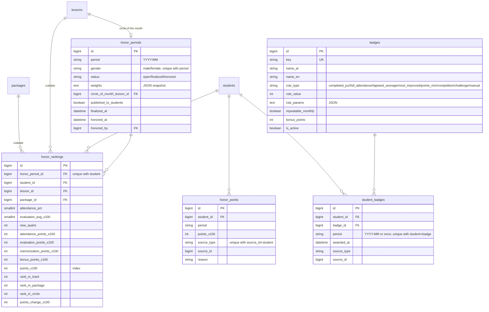

- Points = attendance 40% + evaluation average 40% + new memorization 20% (weights in settings `honor.weight_*`, snapshotted per period). Rankings are always per gender track; boys and girls never share a period row.
- Excellence certificates reuse `certificates` (type `excellence`, `honor_period_id`).

## J. Competitions and challenges (section 14)

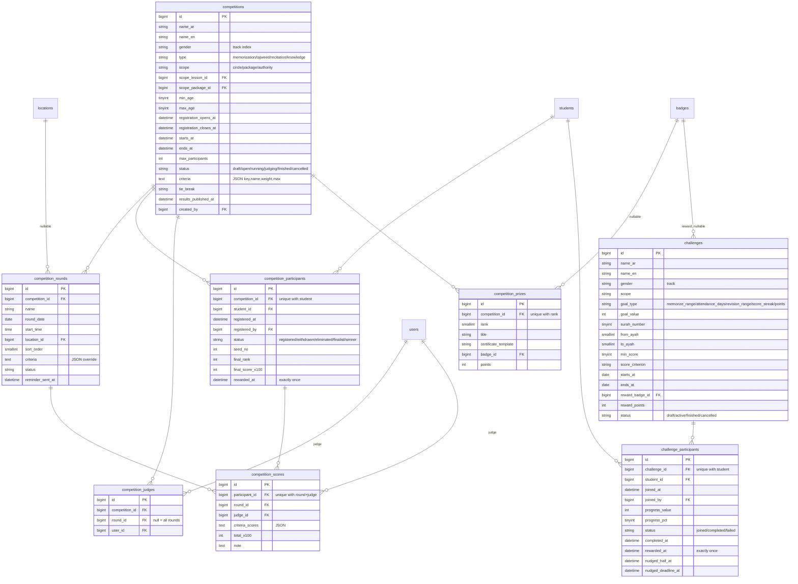

- Judges must be staff of the competition's track (checked in Form Requests and Policies). Totals are the weighted criteria (×100) averaged across judges; results stay hidden until `results_published_at`.
- Challenge progress is computed nightly and on every attendance, evaluation and ledger save; `rewarded_at` guards the badge and `honor_points` row so rewards are written once.
- `certificates` gains `competition_id` (type `competition`).
## Key invariants enforced in code (and covered by tests)

1. `wallets.balance_fils` always equals `SUM(wallet_transactions.amount_fils)` for that wallet. Every write goes through `WalletService` inside `DB::transaction()` with `lockForUpdate()`.
2. `invoices.paid_fils` always equals `SUM(invoice_payments.amount_fils)` for that invoice; status derives from `paid_fils` vs `amount_fils`.
3. A student has at most one active `lesson_students` row per package (unique on `lesson_id + student_id`, plus service check).
4. `registration_requests.age_at_start` is computed from `birth_date` and `packages.start_date` server-side; gender and age range are validated in the Form Request.
5. Exam attempts can only be started inside `[opens_at, closes_at]`, and `expires_at = min(started_at + duration, closes_at)`. Answers after `expires_at` are rejected.
6. Photos: originals are discarded; only the 512 px and 96 px WebP variants are stored, and they are served only via 10-minute signed URLs checked by `StudentPolicy::viewPhoto`.
