# Screenshots — لقطات من النظام

Staff web app with the demo data (`DemoSeeder`), in Arabic (RTL) and English (LTR), on desktop (1440 × 900) and phone (390 × 844).
Taken on 28 September 2026 against the development build.

واجهة الموظفين ببيانات العرض التجريبية، بالعربية والإنجليزية، على الحاسوب والهاتف.

## Dashboard — لوحة التحكم

Today's circles, alerts that need a decision, KPIs, 14-day attendance, ages, memorization progress, fees and recent activity.

| العربية | English |
|---|---|
|  |  |

## Students — الطلاب

Filterable student list (track, circle, juz, status, dues) and the student profile with the 30-juz memorization map.

| الطلاب | Students |
|---|---|
| 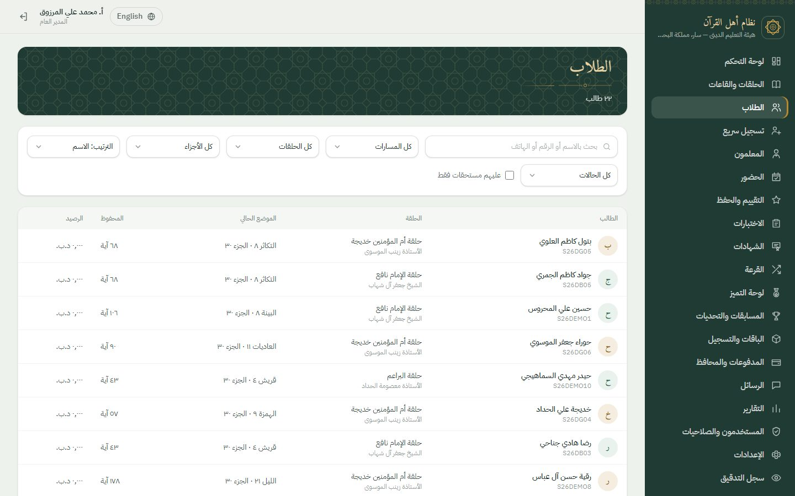 | 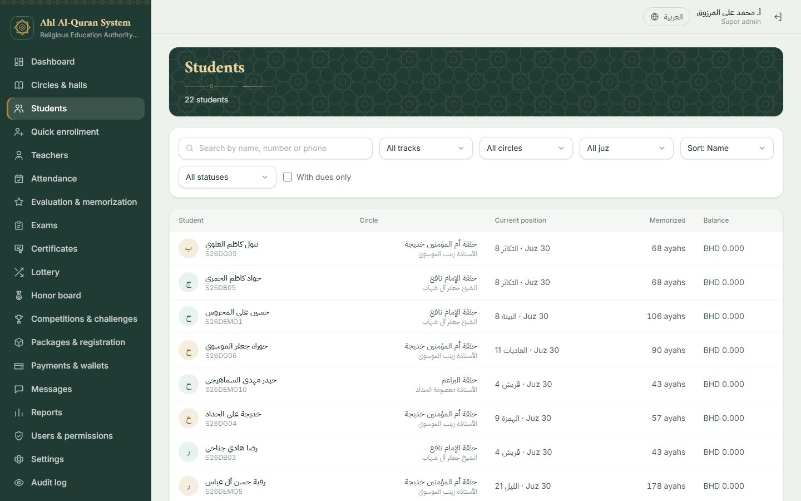 |

| ملف الطالب |
|---|
| 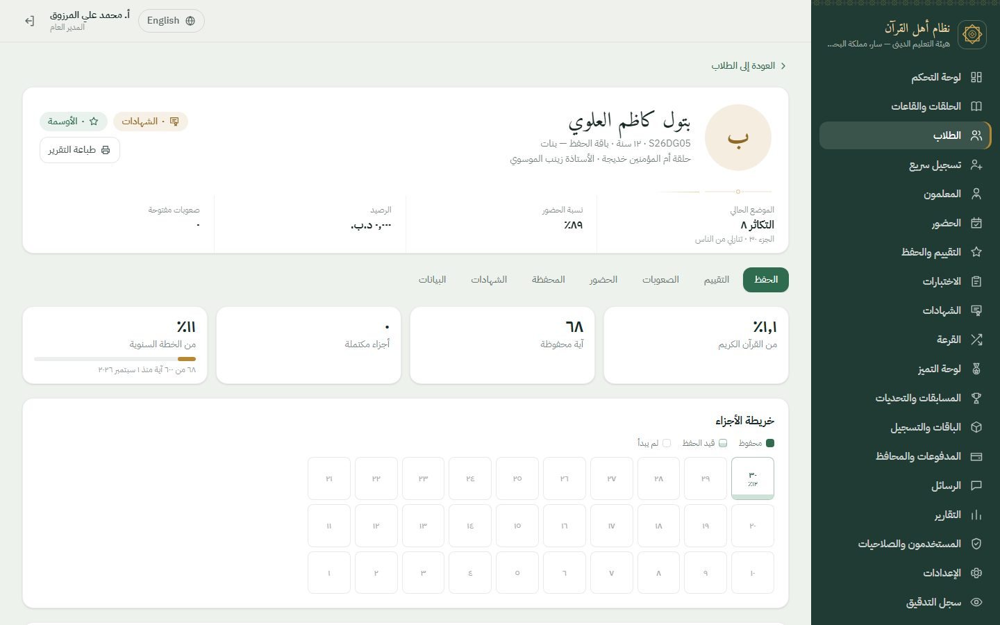 |

## Circles and halls — الحلقات والقاعات

Circles with their teacher, package, schedule, hall and capacity, and the circle page with hall conflicts, students and upcoming sessions.

| الحلقات | Circle detail |
|---|---|
| 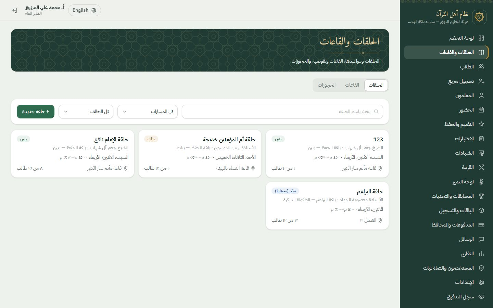 | 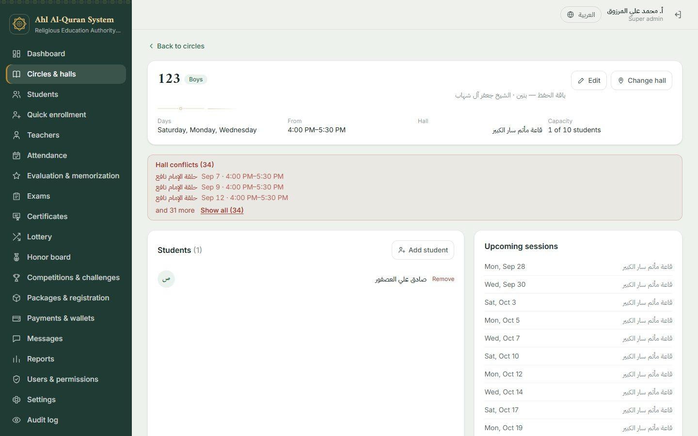 |

| تفاصيل الحلقة |
|---|
| 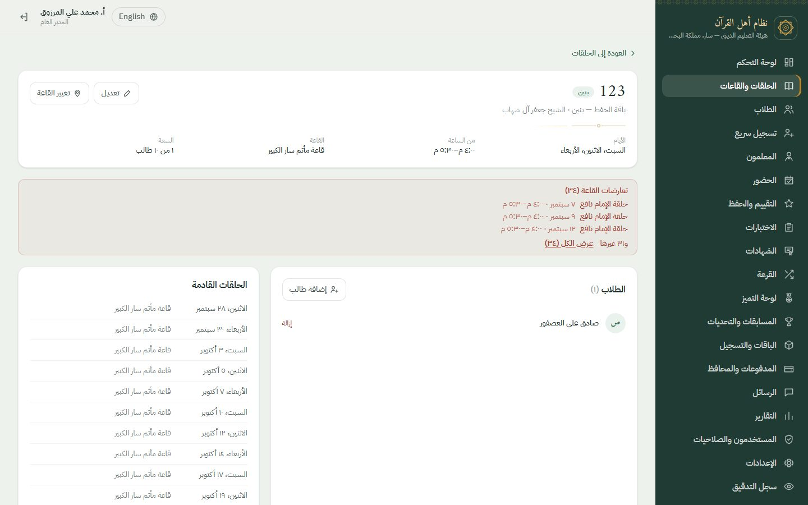 |

## Attendance and evaluation — الحضور والتقييم

The attendance sheet (present, late, absent, excused, with "mark all present") and the daily evaluation sheet (memorization, tajweed, review, behaviour and a note to the guardian).

| كشف الحضور | Attendance sheet |
|---|---|
|  | 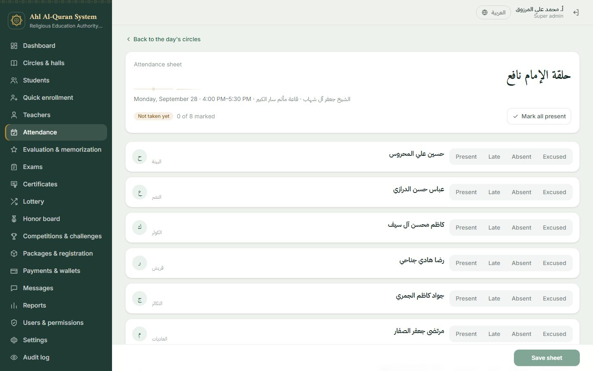 |

| كشف التقييم |
|---|
| 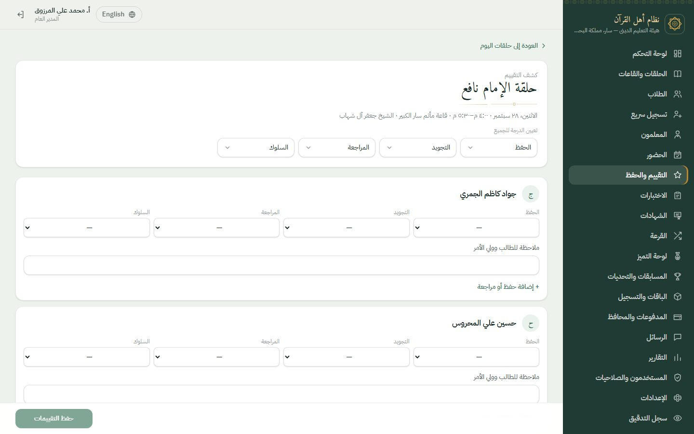 |

## Honor board — لوحة التميز

Monthly ranking by attendance, evaluation and memorization, with the podium, the points breakdown and the circle of the month.

| العربية | English |
|---|---|
| 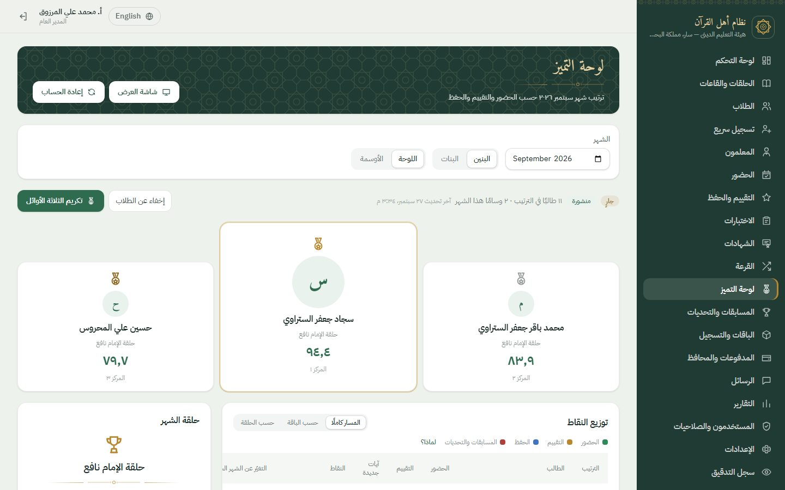 |  |

## Enrollment, messages and reports — التسجيل والرسائل والتقارير

| تسجيل سريع | الرسائل |
|---|---|
| 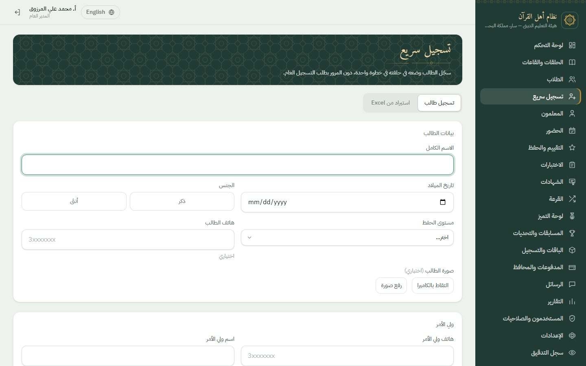 | 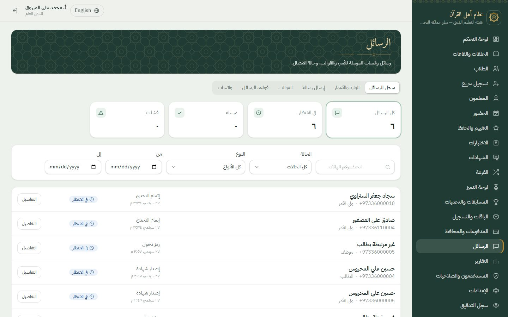 |

| التقارير |
|---|
| 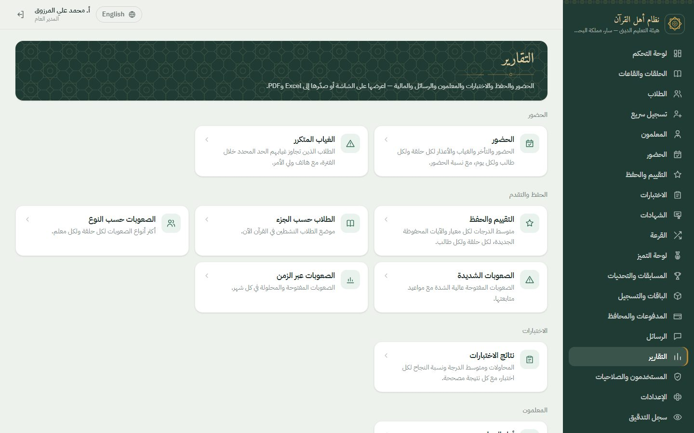 |

## Sign in — تسجيل الدخول

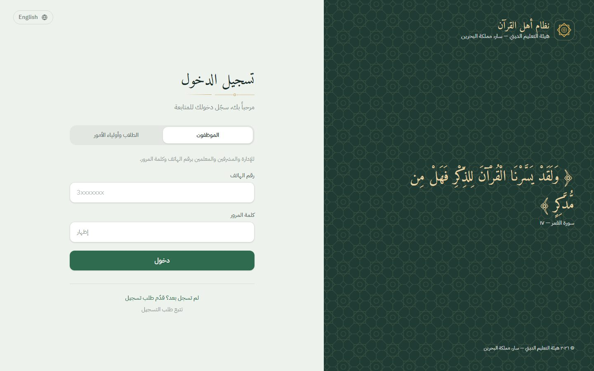

## Phone — الهاتف

| لوحة التحكم | Dashboard | كشف الحضور | القائمة | Sign in |
|---|---|---|---|---|
| 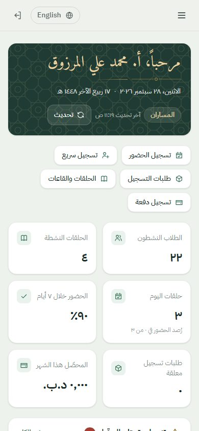 | 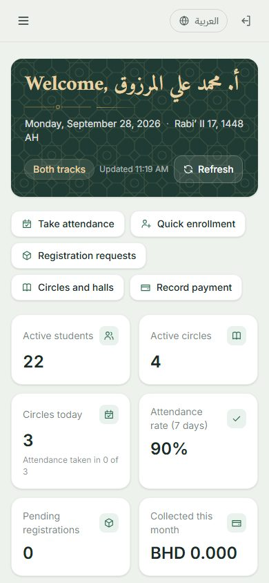 | 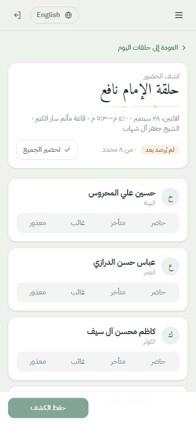 | 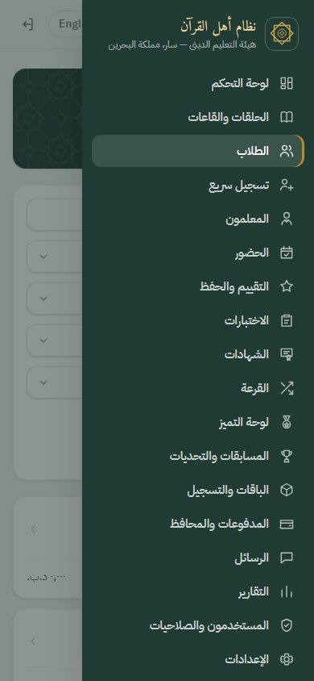 | 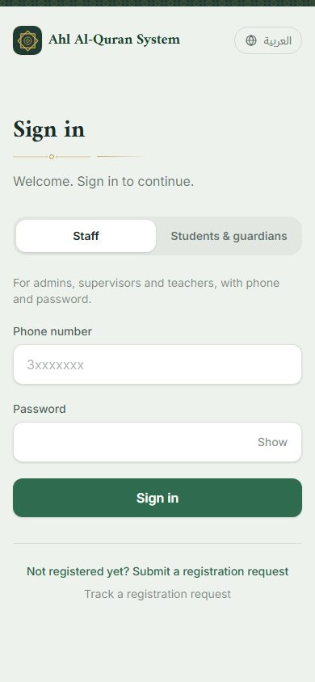 |
